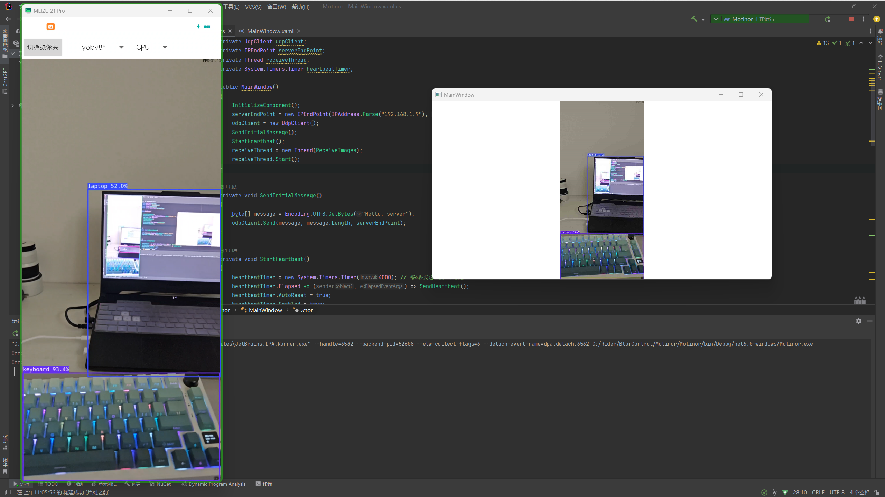
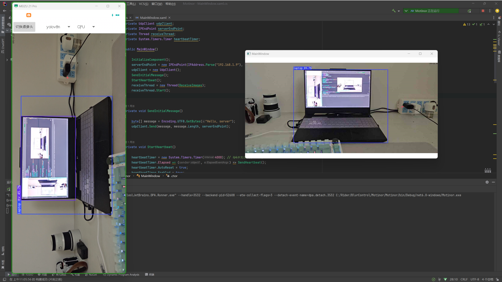
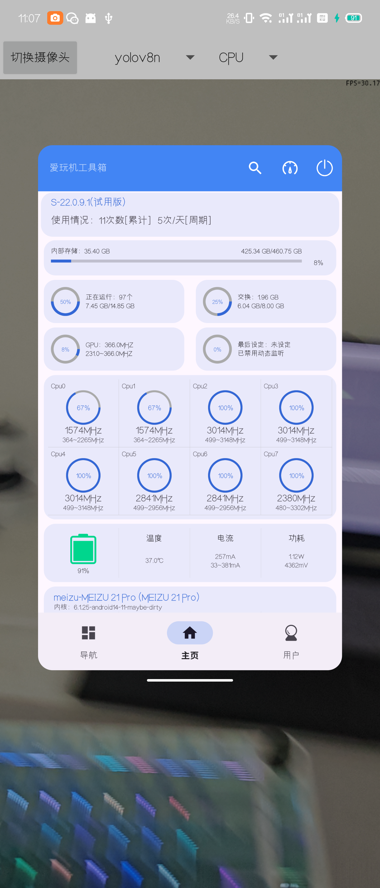

## 旧手机改监控

**前言：** 暑假赋闲在家，有时候几个伯伯会来喊我有事情，我在自己的房间放歌总是听不见，这让他们很烦恼，于是就想着自己做一个监控，正好让爸爸妈妈也能有空看看家门口。

由于需要在有人出现的时候对我发送提醒，所以这里需要引入**物体识别**。这里为了方便，直接用开源的**YoloV8**了。接下来就是硬件的选择，最先考虑的是**Esp32-cam**，因为它很便宜，**IDF**库用起来也不是很麻烦。但是它的算力太垃圾了，传输视频到是可以，但是推理模型就显得力不从心了，而且主流的模型推理库似乎没有适配Risc-V架构的，这样要实现物体检测就必须再搭配一个上位机，显然不符合原本的设计理念。故只好放弃**ESP-32cam**，从而选择了**Android**平台。

**Android**平台能用的资源很多，更好的CPU/GPU，更丰富的外设，更舒适的开发环境，而且旧手机不用钱，能干很多事情。(我觉得旧手机就是最屌的嵌入式设备，吊打其他开发板，搭载855Soc的手机现在200-300就能买到嘻嘻)

那么接下来就是实现Camera和Yolo推理

### Camera

使用的**camera2** api，在so层实现，写完之后写Yolo推理的时候才发现，有个大佬写好的项目和我的需求简直完美契合，先贴一下我写的ndk camera代码吧。

```cpp
#include <assert.h>
#include <jni.h>
#include <pthread.h>

#include <android/native_window_jni.h>

#include <camera/NdkCameraDevice.h>
#include <camera/NdkCameraManager.h>

#include <android/log.h>

#define  LOG_TAG    "Native_Camera"
#define  LOGI(...)  __android_log_print(ANDROID_LOG_INFO,LOG_TAG,__VA_ARGS__)
#define  LOGE(...)  __android_log_print(ANDROID_LOG_ERROR,LOG_TAG,__VA_ARGS__)

static ANativeWindow *theNativeWindow;
static ACameraDevice *cameraDevice;
static ACaptureRequest *captureRequest;
static ACameraOutputTarget *cameraOutputTarget;
static ACaptureSessionOutput *sessionOutput;
static ACaptureSessionOutputContainer *captureSessionOutputContainer;
static ACameraCaptureSession *captureSession;

static ACameraDevice_StateCallbacks deviceStateCallbacks;
static ACameraCaptureSession_stateCallbacks captureSessionStateCallbacks;

static void camera_device_on_disconnected(void *context, ACameraDevice *device) {
    LOGI("Camera(id: %s) is diconnected.\n", ACameraDevice_getId(device));
}

static void camera_device_on_error(void *context, ACameraDevice *device, int error) {
    LOGE("Error(code: %d) on Camera(id: %s).\n", error, ACameraDevice_getId(device));
}

static void capture_session_on_ready(void *context, ACameraCaptureSession *session) {
    LOGI("Session is ready. %p\n", session);
}

static void capture_session_on_active(void *context, ACameraCaptureSession *session) {
    LOGI("Session is activated. %p\n", session);
}

static void capture_session_on_closed(void *context, ACameraCaptureSession *session) {
    LOGI("Session is closed. %p\n", session);
}


static void openCamera(ACameraDevice_request_template templateId)
{
    ACameraIdList *cameraIdList = NULL;
    ACameraMetadata *cameraMetadata = NULL;

    const char *selectedCameraId = NULL;
    camera_status_t camera_status = ACAMERA_OK;
    ACameraManager *cameraManager = ACameraManager_create();

    camera_status = ACameraManager_getCameraIdList(cameraManager, &cameraIdList);
    if (camera_status != ACAMERA_OK) {
        LOGE("Failed to get camera id list (reason: %d)\n", camera_status);
        return;
    }

    if (cameraIdList->numCameras < 1) {
        LOGE("No camera device detected.\n");
        return;
    }
    //实测三星S22 numCameras = 4
    selectedCameraId = cameraIdList->cameraIds[0];

    LOGI("Trying to open Camera2 (id: %s, num of camera : %d)\n", selectedCameraId,
         cameraIdList->numCameras);

    camera_status = ACameraManager_getCameraCharacteristics(cameraManager, selectedCameraId,
                                                            &cameraMetadata);

    if (camera_status != ACAMERA_OK) {
        LOGE("Failed to get camera meta data of ID:%s\n", selectedCameraId);
    }

    deviceStateCallbacks.onDisconnected = camera_device_on_disconnected;
    deviceStateCallbacks.onError = camera_device_on_error;

    camera_status = ACameraManager_openCamera(cameraManager, selectedCameraId,
                                              &deviceStateCallbacks, &cameraDevice);

    if (camera_status != ACAMERA_OK) {
        LOGE("Failed to open camera device (id: %s)\n", selectedCameraId);
    }

    camera_status = ACameraDevice_createCaptureRequest(cameraDevice, templateId,
                                                       &captureRequest);

    if (camera_status != ACAMERA_OK) {
        LOGE("Failed to create preview capture request (id: %s)\n", selectedCameraId);
    }

    ACaptureSessionOutputContainer_create(&captureSessionOutputContainer);

    captureSessionStateCallbacks.onReady = capture_session_on_ready;
    captureSessionStateCallbacks.onActive = capture_session_on_active;
    captureSessionStateCallbacks.onClosed = capture_session_on_closed;

    ACameraMetadata_free(cameraMetadata);
    ACameraManager_deleteCameraIdList(cameraIdList);
    ACameraManager_delete(cameraManager);
}

static void closeCamera(void)
{
    camera_status_t camera_status = ACAMERA_OK;

    if (captureRequest != NULL) {
        ACaptureRequest_free(captureRequest);
        captureRequest = NULL;
    }

    if (cameraOutputTarget != NULL) {
        ACameraOutputTarget_free(cameraOutputTarget);
        cameraOutputTarget = NULL;
    }

    if (cameraDevice != NULL) {
        camera_status = ACameraDevice_close(cameraDevice);

        if (camera_status != ACAMERA_OK) {
            LOGE("Failed to close CameraDevice.\n");
        }
        cameraDevice = NULL;
    }

    if (sessionOutput != NULL) {
        ACaptureSessionOutput_free(sessionOutput);
        sessionOutput = NULL;
    }

    if (captureSessionOutputContainer != NULL) {
        ACaptureSessionOutputContainer_free(captureSessionOutputContainer);
        captureSessionOutputContainer = NULL;
    }

    LOGI("Close Camera\n");
}

static ANativeWindow *extraViewWindow;
static ACaptureRequest *extraViewCaptureRequest;
static ACameraOutputTarget *extraViewOutputTarget;
static ACaptureSessionOutput *extraViewSessionOutput;


extern "C" JNIEXPORT void JNICALL Java_com_yuuki_Native_1Camera_Utils_Camera2Helper_startPreview(JNIEnv *env,
                                                                                     jclass clazz,
                                                                                     jobject surface) {
    theNativeWindow = ANativeWindow_fromSurface(env, surface);

    openCamera(TEMPLATE_PREVIEW);

    LOGI("Surface is prepared in %p.\n", surface);

    ACameraOutputTarget_create(theNativeWindow, &cameraOutputTarget);
    ACaptureRequest_addTarget(captureRequest, cameraOutputTarget);

    ACaptureSessionOutput_create(theNativeWindow, &sessionOutput);
    ACaptureSessionOutputContainer_add(captureSessionOutputContainer, sessionOutput);

    ACameraDevice_createCaptureSession(cameraDevice, captureSessionOutputContainer,
                                       &captureSessionStateCallbacks, &captureSession);

    ACameraCaptureSession_setRepeatingRequest(captureSession, NULL, 1, &captureRequest, NULL);

}

extern "C" JNIEXPORT void JNICALL Java_com_yuuki_Native_1Camera_Utils_Camera2Helper_stopPreview(JNIEnv *env,
                                                                                    jclass clazz) {
    closeCamera();
    if (theNativeWindow != NULL) {
        ANativeWindow_release(theNativeWindow);
        theNativeWindow = NULL;
    }
}

extern "C" JNIEXPORT void JNICALL Java_com_yuuki_Native_1Camera_Utils_Camera2Helper_startExtraView(JNIEnv *env,
                                                                                       jclass clazz,
                                                                                       jobject surface) {

    /* Assuming that camera preview has already been started */
    extraViewWindow = ANativeWindow_fromSurface(env, surface);

    LOGI("Extra view surface is prepared in %p.\n", surface);
    ACameraCaptureSession_stopRepeating(captureSession);

    ACameraDevice_createCaptureRequest(cameraDevice, TEMPLATE_STILL_CAPTURE,
                                       &extraViewCaptureRequest);

    ACameraOutputTarget_create(extraViewWindow, &extraViewOutputTarget);
    ACaptureRequest_addTarget(extraViewCaptureRequest, extraViewOutputTarget);

    ACaptureSessionOutput_create(extraViewWindow, &extraViewSessionOutput);
    ACaptureSessionOutputContainer_add(captureSessionOutputContainer,
                                       extraViewSessionOutput);

    /* Not sure why the session should be recreated.
     * Otherwise, the session state goes to ready */
    ACameraCaptureSession_close(captureSession);
    ACameraDevice_createCaptureSession(cameraDevice, captureSessionOutputContainer,
                                       &captureSessionStateCallbacks, &captureSession);

    ACaptureRequest *requests[2];
    requests[0] = captureRequest;
    requests[1] = extraViewCaptureRequest;

    ACameraCaptureSession_setRepeatingRequest(captureSession, NULL, 2, requests, NULL);
}

extern "C" JNIEXPORT void JNICALL Java_com_yuuki_Native_1Camera_Utils_Camera2Helper_stopExtraView(JNIEnv *env,
                                                                                      jclass clazz) {

    ACameraCaptureSession_stopRepeating(captureSession);

    ACaptureSessionOutputContainer_remove(captureSessionOutputContainer, extraViewSessionOutput);

    ACaptureRequest_removeTarget(extraViewCaptureRequest, extraViewOutputTarget);

    ACameraOutputTarget_free(extraViewOutputTarget);
    ACaptureSessionOutput_free(extraViewSessionOutput);
    ACaptureRequest_free(extraViewCaptureRequest);

    ACameraCaptureSession_setRepeatingRequest(captureSession, NULL, 1, &captureRequest, NULL);

    if (extraViewWindow != NULL) {
        ANativeWindow_release(extraViewWindow);
        extraViewWindow = NULL;
        LOGI("Extra view surface is released\n");

    }
}
```

```java
package com.yuuki.Native_Camera.Utils;

import android.view.Surface;

public class Camera2Helper {
    static {
        System.loadLibrary("Native_Camera");
    }

    private native void startPreview(Surface surface);
    private native void stopPreview();
    private native void startExtraView();
    private native void stopExtraView();

    public void start(Surface surface) {
        startPreview(surface);
    }

    public void stop() {
        stopPreview();
    }

}
```

```java
package com.yuuki.Native_Camera;

import androidx.appcompat.app.AppCompatActivity;

import android.os.Bundle;
import android.util.Log;
import android.view.SurfaceHolder;
import android.view.SurfaceView;

import com.yuuki.Native_Camera.Utils.Camera2Helper;
import com.yuuki.Native_Camera.databinding.ActivityMainBinding;


public class MainActivity extends AppCompatActivity {

    static final String TAG = "JAVA_Camera";
    private ActivityMainBinding binding;

    SurfaceView surfaceView;
    SurfaceHolder surfaceHolder;

    @Override
    protected void onCreate(Bundle savedInstanceState) {
        super.onCreate(savedInstanceState);

        binding = ActivityMainBinding.inflate(getLayoutInflater());
        setContentView(binding.getRoot());
        surfaceView = binding.surfaceview;
        surfaceHolder = surfaceView.getHolder();

        Camera2Helper camera = new Camera2Helper();
        surfaceHolder.addCallback(new SurfaceHolder.Callback() {
            @Override
            public void surfaceCreated(SurfaceHolder holder) {

                Log.v(TAG, "surface created.");
                camera.start(holder.getSurface());
            }

            @Override
            public void surfaceDestroyed(SurfaceHolder holder) {
                camera.stop();
            }

            @Override
            public void surfaceChanged(SurfaceHolder holder, int format, int width, int height) {
                Log.v(TAG, "format=" + format + " w/h : (" + width + ", " + height + ")");
            }
        });

    }
    @Override
    protected void onDestroy() {
        Camera2Helper camera = new Camera2Helper();
        camera.stop();
        super.onDestroy();
    }

}
```

为什么自己写呢，因为不想用**opencv**库，但是后来想起来要在每一帧上面画东西，想想还是得用库哈哈哈哈，一阵白忙活。后来逛Github发现[FeiGeChuanShu](https://github.com/FeiGeChuanShu)大佬有个项目简直太满足我的使用场景了，于是干脆直接抄了哈哈哈。

这里贴一下大佬的NdkCamera部分代码

```cpp
#include "ndkcamera.h"
#include <string>
#include <android/log.h>
#include <opencv2/core/core.hpp>
#include "mat.h"

static void onDisconnected(void* context, ACameraDevice* device)
{
    __android_log_print(ANDROID_LOG_WARN, "NdkCamera", "onDisconnected %p", device);
}

static void onError(void* context, ACameraDevice* device, int error)
{
    __android_log_print(ANDROID_LOG_WARN, "NdkCamera", "onError %p %d", device, error);
}

static void onImageAvailable(void* context, AImageReader* reader)
{
//     __android_log_print(ANDROID_LOG_WARN, "NdkCamera", "onImageAvailable %p", reader);

    AImage* image = 0;
    media_status_t status = AImageReader_acquireLatestImage(reader, &image);

    if (status != AMEDIA_OK)
    {
        // error
        return;
    }

    int32_t format;
    AImage_getFormat(image, &format);

    // assert format == AIMAGE_FORMAT_YUV_420_888

    int32_t width = 0;
    int32_t height = 0;
    AImage_getWidth(image, &width);
    AImage_getHeight(image, &height);

    int32_t y_pixelStride = 0;
    int32_t u_pixelStride = 0;
    int32_t v_pixelStride = 0;
    AImage_getPlanePixelStride(image, 0, &y_pixelStride);
    AImage_getPlanePixelStride(image, 1, &u_pixelStride);
    AImage_getPlanePixelStride(image, 2, &v_pixelStride);

    int32_t y_rowStride = 0;
    int32_t u_rowStride = 0;
    int32_t v_rowStride = 0;
    AImage_getPlaneRowStride(image, 0, &y_rowStride);
    AImage_getPlaneRowStride(image, 1, &u_rowStride);
    AImage_getPlaneRowStride(image, 2, &v_rowStride);

    uint8_t* y_data = 0;
    uint8_t* u_data = 0;
    uint8_t* v_data = 0;
    int y_len = 0;
    int u_len = 0;
    int v_len = 0;
    AImage_getPlaneData(image, 0, &y_data, &y_len);
    AImage_getPlaneData(image, 1, &u_data, &u_len);
    AImage_getPlaneData(image, 2, &v_data, &v_len);

    if (u_data == v_data + 1 && v_data == y_data + width * height && y_pixelStride == 1 && u_pixelStride == 2 && v_pixelStride == 2 && y_rowStride == width && u_rowStride == width && v_rowStride == width)
    {
        // already nv21  :)
        ((NdkCamera*)context)->on_image((unsigned char*)y_data, (int)width, (int)height);
    }
    else
    {
        // construct nv21
        unsigned char* nv21 = new unsigned char[width * height + width * height / 2];
        {
            // Y
            unsigned char* yptr = nv21;
            for (int y=0; y<height; y++)
            {
                const unsigned char* y_data_ptr = y_data + y_rowStride * y;
                for (int x=0; x<width; x++)
                {
                    yptr[0] = y_data_ptr[0];
                    yptr++;
                    y_data_ptr += y_pixelStride;
                }
            }

            // UV
            unsigned char* uvptr = nv21 + width * height;
            for (int y=0; y<height/2; y++)
            {
                const unsigned char* v_data_ptr = v_data + v_rowStride * y;
                const unsigned char* u_data_ptr = u_data + u_rowStride * y;
                for (int x=0; x<width/2; x++)
                {
                    uvptr[0] = v_data_ptr[0];
                    uvptr[1] = u_data_ptr[0];
                    uvptr += 2;
                    v_data_ptr += v_pixelStride;
                    u_data_ptr += u_pixelStride;
                }
            }
        }

        ((NdkCamera*)context)->on_image((unsigned char*)nv21, (int)width, (int)height);

        delete[] nv21;
    }

    AImage_delete(image);
}

static void onSessionActive(void* context, ACameraCaptureSession *session)
{
    __android_log_print(ANDROID_LOG_WARN, "NdkCamera", "onSessionActive %p", session);
}

static void onSessionReady(void* context, ACameraCaptureSession *session)
{
    __android_log_print(ANDROID_LOG_WARN, "NdkCamera", "onSessionReady %p", session);
}

static void onSessionClosed(void* context, ACameraCaptureSession *session)
{
    __android_log_print(ANDROID_LOG_WARN, "NdkCamera", "onSessionClosed %p", session);
}

void onCaptureFailed(void* context, ACameraCaptureSession* session, ACaptureRequest* request, ACameraCaptureFailure* failure)
{
    __android_log_print(ANDROID_LOG_WARN, "NdkCamera", "onCaptureFailed %p %p %p", session, request, failure);
}

void onCaptureSequenceCompleted(void* context, ACameraCaptureSession* session, int sequenceId, int64_t frameNumber)
{
    __android_log_print(ANDROID_LOG_WARN, "NdkCamera", "onCaptureSequenceCompleted %p %d %ld", session, sequenceId, frameNumber);
}

void onCaptureSequenceAborted(void* context, ACameraCaptureSession* session, int sequenceId)
{
    __android_log_print(ANDROID_LOG_WARN, "NdkCamera", "onCaptureSequenceAborted %p %d", session, sequenceId);
}

void onCaptureCompleted(void* context, ACameraCaptureSession* session, ACaptureRequest* request, const ACameraMetadata* result)
{
//     __android_log_print(ANDROID_LOG_WARN, "NdkCamera", "onCaptureCompleted %p %p %p", session, request, result);
}

NdkCamera::NdkCamera()
{
    camera_facing = 0;
    camera_orientation = 0;

    camera_manager = 0;
    camera_device = 0;
    image_reader = 0;
    image_reader_surface = 0;
    image_reader_target = 0;
    capture_request = 0;
    capture_session_output_container = 0;
    capture_session_output = 0;
    capture_session = 0;


    // setup imagereader and its surface
    {
        AImageReader_new(640, 480, AIMAGE_FORMAT_YUV_420_888, /*maxImages*/2, &image_reader);

        AImageReader_ImageListener listener;
        listener.context = this;
        listener.onImageAvailable = onImageAvailable;

        AImageReader_setImageListener(image_reader, &listener);

        AImageReader_getWindow(image_reader, &image_reader_surface);

        ANativeWindow_acquire(image_reader_surface);
    }
}

NdkCamera::~NdkCamera()
{
    close();

    if (image_reader)
    {
        AImageReader_delete(image_reader);
        image_reader = 0;
    }

    if (image_reader_surface)
    {
        ANativeWindow_release(image_reader_surface);
        image_reader_surface = 0;
    }
}

int NdkCamera::open(int _camera_facing)
{
    __android_log_print(ANDROID_LOG_WARN, "NdkCamera", "open");

    camera_facing = _camera_facing;

    camera_manager = ACameraManager_create();

    // find front camera
    std::string camera_id;
    {
        ACameraIdList* camera_id_list = 0;
        ACameraManager_getCameraIdList(camera_manager, &camera_id_list);

        for (int i = 0; i < camera_id_list->numCameras; ++i)
        {
            const char* id = camera_id_list->cameraIds[i];
            ACameraMetadata* camera_metadata = 0;
            ACameraManager_getCameraCharacteristics(camera_manager, id, &camera_metadata);

            // query faceing
            acamera_metadata_enum_android_lens_facing_t facing = ACAMERA_LENS_FACING_FRONT;
            {
                ACameraMetadata_const_entry e = { 0 };
                ACameraMetadata_getConstEntry(camera_metadata, ACAMERA_LENS_FACING, &e);
                facing = (acamera_metadata_enum_android_lens_facing_t)e.data.u8[0];
            }

            if (camera_facing == 0 && facing != ACAMERA_LENS_FACING_FRONT)
            {
                ACameraMetadata_free(camera_metadata);
                continue;
            }

            if (camera_facing == 1 && facing != ACAMERA_LENS_FACING_BACK)
            {
                ACameraMetadata_free(camera_metadata);
                continue;
            }

            camera_id = id;

            // query orientation
            int orientation = 0;
            {
                ACameraMetadata_const_entry e = { 0 };
                ACameraMetadata_getConstEntry(camera_metadata, ACAMERA_SENSOR_ORIENTATION, &e);

                orientation = (int)e.data.i32[0];
            }

            camera_orientation = orientation;

            ACameraMetadata_free(camera_metadata);

            break;
        }

        ACameraManager_deleteCameraIdList(camera_id_list);
    }

    __android_log_print(ANDROID_LOG_WARN, "NdkCamera", "open %s %d", camera_id.c_str(), camera_orientation);

    // open camera
    {
        ACameraDevice_StateCallbacks camera_device_state_callbacks;
        camera_device_state_callbacks.context = this;
        camera_device_state_callbacks.onDisconnected = onDisconnected;
        camera_device_state_callbacks.onError = onError;

        ACameraManager_openCamera(camera_manager, camera_id.c_str(), &camera_device_state_callbacks, &camera_device);
    }

    // capture request
    {
        ACameraDevice_createCaptureRequest(camera_device, TEMPLATE_PREVIEW, &capture_request);

        ACameraOutputTarget_create(image_reader_surface, &image_reader_target);
        ACaptureRequest_addTarget(capture_request, image_reader_target);
    }

    // capture session
    {
        ACameraCaptureSession_stateCallbacks camera_capture_session_state_callbacks;
        camera_capture_session_state_callbacks.context = this;
        camera_capture_session_state_callbacks.onActive = onSessionActive;
        camera_capture_session_state_callbacks.onReady = onSessionReady;
        camera_capture_session_state_callbacks.onClosed = onSessionClosed;

        ACaptureSessionOutputContainer_create(&capture_session_output_container);

        ACaptureSessionOutput_create(image_reader_surface, &capture_session_output);

        ACaptureSessionOutputContainer_add(capture_session_output_container, capture_session_output);

        ACameraDevice_createCaptureSession(camera_device, capture_session_output_container, &camera_capture_session_state_callbacks, &capture_session);

        ACameraCaptureSession_captureCallbacks camera_capture_session_capture_callbacks;
        camera_capture_session_capture_callbacks.context = this;
        camera_capture_session_capture_callbacks.onCaptureStarted = 0;
        camera_capture_session_capture_callbacks.onCaptureProgressed = 0;
        camera_capture_session_capture_callbacks.onCaptureCompleted = onCaptureCompleted;
        camera_capture_session_capture_callbacks.onCaptureFailed = onCaptureFailed;
        camera_capture_session_capture_callbacks.onCaptureSequenceCompleted = onCaptureSequenceCompleted;
        camera_capture_session_capture_callbacks.onCaptureSequenceAborted = onCaptureSequenceAborted;
        camera_capture_session_capture_callbacks.onCaptureBufferLost = 0;

        ACameraCaptureSession_setRepeatingRequest(capture_session, &camera_capture_session_capture_callbacks, 1, &capture_request, nullptr);
    }

    return 0;
}

void NdkCamera::close()
{
    __android_log_print(ANDROID_LOG_WARN, "NdkCamera", "close");

    if (capture_session)
    {
        ACameraCaptureSession_stopRepeating(capture_session);
        ACameraCaptureSession_close(capture_session);
        capture_session = 0;
    }

    if (camera_device)
    {
        ACameraDevice_close(camera_device);
        camera_device = 0;
    }

    if (capture_session_output_container)
    {
        ACaptureSessionOutputContainer_free(capture_session_output_container);
        capture_session_output_container = 0;
    }

    if (capture_session_output)
    {
        ACaptureSessionOutput_free(capture_session_output);
        capture_session_output = 0;
    }

    if (capture_request)
    {
        ACaptureRequest_free(capture_request);
        capture_request = 0;
    }

    if (image_reader_target)
    {
        ACameraOutputTarget_free(image_reader_target);
        image_reader_target = 0;
    }

    if (camera_manager)
    {
        ACameraManager_delete(camera_manager);
        camera_manager = 0;
    }
}

void NdkCamera::on_image(const cv::Mat& rgb) const
{
}

void NdkCamera::on_image(const unsigned char* nv21, int nv21_width, int nv21_height) const
{
    // rotate nv21
    int w = 0;
    int h = 0;
    int rotate_type = 0;
    {
        if (camera_orientation == 0)
        {
            w = nv21_width;
            h = nv21_height;
            rotate_type = camera_facing == 0 ? 2 : 1;
        }
        if (camera_orientation == 90)
        {
            w = nv21_height;
            h = nv21_width;
            rotate_type = camera_facing == 0 ? 5 : 6;
        }
        if (camera_orientation == 180)
        {
            w = nv21_width;
            h = nv21_height;
            rotate_type = camera_facing == 0 ? 4 : 3;
        }
        if (camera_orientation == 270)
        {
            w = nv21_height;
            h = nv21_width;
            rotate_type = camera_facing == 0 ? 7 : 8;
        }
    }

    cv::Mat nv21_rotated(h + h / 2, w, CV_8UC1);
    ncnn::kanna_rotate_yuv420sp(nv21, nv21_width, nv21_height, nv21_rotated.data, w, h, rotate_type);

    // nv21_rotated to rgb
    cv::Mat rgb(h, w, CV_8UC3);
    ncnn::yuv420sp2rgb(nv21_rotated.data, w, h, rgb.data);

    on_image(rgb);
}

static const int NDKCAMERAWINDOW_ID = 233;

NdkCameraWindow::NdkCameraWindow() : NdkCamera()
{
    sensor_manager = 0;
    sensor_event_queue = 0;
    accelerometer_sensor = 0;
    win = 0;

    accelerometer_orientation = 0;

    // sensor
    sensor_manager = ASensorManager_getInstance();

    accelerometer_sensor = ASensorManager_getDefaultSensor(sensor_manager, ASENSOR_TYPE_ACCELEROMETER);
}

NdkCameraWindow::~NdkCameraWindow()
{
    if (accelerometer_sensor)
    {
        ASensorEventQueue_disableSensor(sensor_event_queue, accelerometer_sensor);
        accelerometer_sensor = 0;
    }

    if (sensor_event_queue)
    {
        ASensorManager_destroyEventQueue(sensor_manager, sensor_event_queue);
        sensor_event_queue = 0;
    }

    if (win)
    {
        ANativeWindow_release(win);
    }
}

void NdkCameraWindow::set_window(ANativeWindow* _win)
{
    if (win)
    {
        ANativeWindow_release(win);
    }

    win = _win;
    ANativeWindow_acquire(win);
}

void NdkCameraWindow::on_image_render(cv::Mat& rgb) const
{
}

void NdkCameraWindow::on_image(const unsigned char* nv21, int nv21_width, int nv21_height) const
{
    // resolve orientation from camera_orientation and accelerometer_sensor
    {
        if (!sensor_event_queue)
        {
            sensor_event_queue = ASensorManager_createEventQueue(sensor_manager, ALooper_prepare(ALOOPER_PREPARE_ALLOW_NON_CALLBACKS), NDKCAMERAWINDOW_ID, 0, 0);

            ASensorEventQueue_enableSensor(sensor_event_queue, accelerometer_sensor);
        }

        int id = ALooper_pollAll(0, 0, 0, 0);
        if (id == NDKCAMERAWINDOW_ID)
        {
            ASensorEvent e[8];
            ssize_t num_event = 0;
            while (ASensorEventQueue_hasEvents(sensor_event_queue) == 1)
            {
                num_event = ASensorEventQueue_getEvents(sensor_event_queue, e, 8);
                if (num_event < 0)
                    break;
            }

            if (num_event > 0)
            {
                float acceleration_x = e[num_event - 1].acceleration.x;
                float acceleration_y = e[num_event - 1].acceleration.y;
                float acceleration_z = e[num_event - 1].acceleration.z;
//                 __android_log_print(ANDROID_LOG_WARN, "NdkCameraWindow", "x = %f, y = %f, z = %f", x, y, z);

                if (acceleration_y > 7)
                {
                    accelerometer_orientation = 0;
                }
                if (acceleration_x < -7)
                {
                    accelerometer_orientation = 90;
                }
                if (acceleration_y < -7)
                {
                    accelerometer_orientation = 180;
                }
                if (acceleration_x > 7)
                {
                    accelerometer_orientation = 270;
                }
            }
        }
    }

    // roi crop and rotate nv21
    int nv21_roi_x = 0;
    int nv21_roi_y = 0;
    int nv21_roi_w = 0;
    int nv21_roi_h = 0;
    int roi_x = 0;
    int roi_y = 0;
    int roi_w = 0;
    int roi_h = 0;
    int rotate_type = 0;
    int render_w = 0;
    int render_h = 0;
    int render_rotate_type = 0;
    {
        int win_w = ANativeWindow_getWidth(win);
        int win_h = ANativeWindow_getHeight(win);

        if (accelerometer_orientation == 90 || accelerometer_orientation == 270)
        {
            std::swap(win_w, win_h);
        }

        const int final_orientation = (camera_orientation + accelerometer_orientation) % 360;

        if (final_orientation == 0 || final_orientation == 180)
        {
            if (win_w * nv21_height > win_h * nv21_width)
            {
                roi_w = nv21_width;
                roi_h = (nv21_width * win_h / win_w) / 2 * 2;
                roi_x = 0;
                roi_y = ((nv21_height - roi_h) / 2) / 2 * 2;
            }
            else
            {
                roi_h = nv21_height;
                roi_w = (nv21_height * win_w / win_h) / 2 * 2;
                roi_x = ((nv21_width - roi_w) / 2) / 2 * 2;
                roi_y = 0;
            }

            nv21_roi_x = roi_x;
            nv21_roi_y = roi_y;
            nv21_roi_w = roi_w;
            nv21_roi_h = roi_h;
        }
        if (final_orientation == 90 || final_orientation == 270)
        {
            if (win_w * nv21_width > win_h * nv21_height)
            {
                roi_w = nv21_height;
                roi_h = (nv21_height * win_h / win_w) / 2 * 2;
                roi_x = 0;
                roi_y = ((nv21_width - roi_h) / 2) / 2 * 2;
            }
            else
            {
                roi_h = nv21_width;
                roi_w = (nv21_width * win_w / win_h) / 2 * 2;
                roi_x = ((nv21_height - roi_w) / 2) / 2 * 2;
                roi_y = 0;
            }

            nv21_roi_x = roi_y;
            nv21_roi_y = roi_x;
            nv21_roi_w = roi_h;
            nv21_roi_h = roi_w;
        }

        if (camera_facing == 0)
        {
            if (camera_orientation == 0 && accelerometer_orientation == 0)
            {
                rotate_type = 2;
            }
            if (camera_orientation == 0 && accelerometer_orientation == 90)
            {
                rotate_type = 7;
            }
            if (camera_orientation == 0 && accelerometer_orientation == 180)
            {
                rotate_type = 4;
            }
            if (camera_orientation == 0 && accelerometer_orientation == 270)
            {
                rotate_type = 5;
            }
            if (camera_orientation == 90 && accelerometer_orientation == 0)
            {
                rotate_type = 5;
            }
            if (camera_orientation == 90 && accelerometer_orientation == 90)
            {
                rotate_type = 2;
            }
            if (camera_orientation == 90 && accelerometer_orientation == 180)
            {
                rotate_type = 7;
            }
            if (camera_orientation == 90 && accelerometer_orientation == 270)
            {
                rotate_type = 4;
            }
            if (camera_orientation == 180 && accelerometer_orientation == 0)
            {
                rotate_type = 4;
            }
            if (camera_orientation == 180 && accelerometer_orientation == 90)
            {
                rotate_type = 5;
            }
            if (camera_orientation == 180 && accelerometer_orientation == 180)
            {
                rotate_type = 2;
            }
            if (camera_orientation == 180 && accelerometer_orientation == 270)
            {
                rotate_type = 7;
            }
            if (camera_orientation == 270 && accelerometer_orientation == 0)
            {
                rotate_type = 7;
            }
            if (camera_orientation == 270 && accelerometer_orientation == 90)
            {
                rotate_type = 4;
            }
            if (camera_orientation == 270 && accelerometer_orientation == 180)
            {
                rotate_type = 5;
            }
            if (camera_orientation == 270 && accelerometer_orientation == 270)
            {
                rotate_type = 2;
            }
        }
        else
        {
            if (final_orientation == 0)
            {
                rotate_type = 1;
            }
            if (final_orientation == 90)
            {
                rotate_type = 6;
            }
            if (final_orientation == 180)
            {
                rotate_type = 3;
            }
            if (final_orientation == 270)
            {
                rotate_type = 8;
            }
        }

        if (accelerometer_orientation == 0)
        {
            render_w = roi_w;
            render_h = roi_h;
            render_rotate_type = 1;
        }
        if (accelerometer_orientation == 90)
        {
            render_w = roi_h;
            render_h = roi_w;
            render_rotate_type = 8;
        }
        if (accelerometer_orientation == 180)
        {
            render_w = roi_w;
            render_h = roi_h;
            render_rotate_type = 3;
        }
        if (accelerometer_orientation == 270)
        {
            render_w = roi_h;
            render_h = roi_w;
            render_rotate_type = 6;
        }
    }

    // crop and rotate nv21
    cv::Mat nv21_croprotated(roi_h + roi_h / 2, roi_w, CV_8UC1);
    {
        const unsigned char* srcY = nv21 + nv21_roi_y * nv21_width + nv21_roi_x;
        unsigned char* dstY = nv21_croprotated.data;
        ncnn::kanna_rotate_c1(srcY, nv21_roi_w, nv21_roi_h, nv21_width, dstY, roi_w, roi_h, roi_w, rotate_type);

        const unsigned char* srcUV = nv21 + nv21_width * nv21_height + nv21_roi_y * nv21_width / 2 + nv21_roi_x;
        unsigned char* dstUV = nv21_croprotated.data + roi_w * roi_h;
        ncnn::kanna_rotate_c2(srcUV, nv21_roi_w / 2, nv21_roi_h / 2, nv21_width, dstUV, roi_w / 2, roi_h / 2, roi_w, rotate_type);
    }

    // nv21_croprotated to rgb
    cv::Mat rgb(roi_h, roi_w, CV_8UC3);
    ncnn::yuv420sp2rgb(nv21_croprotated.data, roi_w, roi_h, rgb.data);

    on_image_render(rgb);

    // rotate to native window orientation
    cv::Mat rgb_render(render_h, render_w, CV_8UC3);
    ncnn::kanna_rotate_c3(rgb.data, roi_w, roi_h, rgb_render.data, render_w, render_h, render_rotate_type);

    ANativeWindow_setBuffersGeometry(win, render_w, render_h, AHARDWAREBUFFER_FORMAT_R8G8B8A8_UNORM);

    ANativeWindow_Buffer buf;
    ANativeWindow_lock(win, &buf, NULL);

    // scale to target size
    if (buf.format == AHARDWAREBUFFER_FORMAT_R8G8B8A8_UNORM || buf.format == AHARDWAREBUFFER_FORMAT_R8G8B8X8_UNORM)
    {
        for (int y = 0; y < render_h; y++)
        {
            const unsigned char* ptr = rgb_render.ptr<const unsigned char>(y);
            unsigned char* outptr = (unsigned char*)buf.bits + buf.stride * 4 * y;

            int x = 0;
#if __ARM_NEON
            for (; x + 7 < render_w; x += 8)
            {
                uint8x8x3_t _rgb = vld3_u8(ptr);
                uint8x8x4_t _rgba;
                _rgba.val[0] = _rgb.val[0];
                _rgba.val[1] = _rgb.val[1];
                _rgba.val[2] = _rgb.val[2];
                _rgba.val[3] = vdup_n_u8(255);
                vst4_u8(outptr, _rgba);

                ptr += 24;
                outptr += 32;
            }
#endif // __ARM_NEON
            for (; x < render_w; x++)
            {
                outptr[0] = ptr[0];
                outptr[1] = ptr[1];
                outptr[2] = ptr[2];
                outptr[3] = 255;

                ptr += 3;
                outptr += 4;
            }
        }
    }

    ANativeWindow_unlockAndPost(win);
}
```

就不过多解读了，很多代码都在做格式的转换。只有两个函数是我们需要关注的，分别是**onImageAvailable**和**on_image**（**on_image_render**也可以，但它在另一个类里被重写了），因为我们需要把每一帧都发送给客户端，所以我们的发送操作需要在这两个函数里进行（这两个函数用于服务端的画面渲染，在这里进行很方便，但是会降低帧率，也可以选择提升帧率的方式，但是太麻烦了，而且会产生延迟）。

这里我选择在**on_image**里进行帧的发送操作，分析代码可以得知在on_image_render(rgb);这个操作之后，图片就只剩下格式转换的操作了，我们直接把此时的Mat压缩成jpeg就可以发送了(**直接发也可以的，但是需要分片，操你妈的烦死了这里，我本来直接发RGB数据，但是客户端解析老是出现花屏，画面分割等一堆问题，无奈出此下策**)，这里贴一下我的代码吧

```cpp
// 自定义哈希函数
struct sockaddr_in_hash {
    size_t operator()(const sockaddr_in& addr) const {
        return std::hash<uint32_t>()(addr.sin_addr.s_addr) ^ std::hash<uint16_t>()(addr.sin_port);
    }
};

// 比较函数
struct sockaddr_in_equal {
    bool operator()(const sockaddr_in& lhs, const sockaddr_in& rhs) const {
        return lhs.sin_family == rhs.sin_family &&
               lhs.sin_addr.s_addr == rhs.sin_addr.s_addr &&
               lhs.sin_port == rhs.sin_port;
    }
};

class UdpServer {
public:
    UdpServer(int port) : port(port) {
        sock = socket(AF_INET, SOCK_DGRAM, 0);
        if (sock < 0) {
            __android_log_print(ANDROID_LOG_ERROR, "SOCKET", "Error: Could not create socket - %s", strerror(errno));
            return;
        }

        server_addr.sin_family = AF_INET;
        server_addr.sin_addr.s_addr = INADDR_ANY;
        server_addr.sin_port = htons(port);

        if (bind(sock, (struct sockaddr*)&server_addr, sizeof(server_addr)) < 0) {
            __android_log_print(ANDROID_LOG_ERROR, "SOCKET", "Error: Could not bind socket - %s", strerror(errno));
            close(sock);
            sock = -1;
        }

        // 设置接收超时
        struct timeval timeout;
        timeout.tv_sec = 5; // 5秒超时
        timeout.tv_usec = 0;
        if (setsockopt(sock, SOL_SOCKET, SO_RCVTIMEO, &timeout, sizeof(timeout)) < 0) {
            __android_log_print(ANDROID_LOG_ERROR, "SOCKET", "Error: Could not set socket options - %s", strerror(errno));
        }

        listen_thread = std::thread(&UdpServer::listen_for_clients, this);
    }

    ~UdpServer() {
        if (sock >= 0) {
            close(sock);
        }
        if (listen_thread.joinable()) {
            listen_thread.join();
        }
    }

    void send(const cv::Mat& img) {
        std::lock_guard<std::mutex> lock(client_mutex);
        if (sock < 0 || client_addresses.empty() || !is_client) {
            __android_log_print(ANDROID_LOG_ERROR, "SOCKET", "Error: Socket is not initialized or no clients are connected");
            return;
        }

        cv::Mat img_rgb;
        cv::cvtColor(img, img_rgb, cv::COLOR_BGR2RGB); // 转换为RGB色彩空间
        std::vector<uchar> buf;
        std::vector<int> params = {cv::IMWRITE_JPEG_QUALITY, 30}; // 极低的JPEG质量参数 max = 60
        if (!cv::imencode(".jpg", img_rgb, buf, params)) {
            __android_log_print(ANDROID_LOG_ERROR, "ENCODE", "Error: Could not encode image");
            return;
        }

        if (buf.size() > 65507) {
            __android_log_print(ANDROID_LOG_ERROR, "ENCODE", "Error: Encoded image size exceeds UDP packet limit");
            return;
        }

        for (const auto& client_addr : client_addresses) {
            ssize_t sent_bytes = sendto(sock, buf.data(), buf.size(), 0, (struct sockaddr*)&client_addr, sizeof(client_addr));
            if (sent_bytes < 0) {
                __android_log_print(ANDROID_LOG_ERROR, "SEND", "Error: Could not send data - %s", strerror(errno));
            }
        }
    }

private:
    void listen_for_clients() {
        while (true) {
            socklen_t len = sizeof(sockaddr_in);
            sockaddr_in client_addr;
            char buffer[1024];
            ssize_t received_bytes = recvfrom(sock, buffer, sizeof(buffer) - 1, 0, (struct sockaddr*)&client_addr, &len);
            if (received_bytes < 0) {
                if (errno == EWOULDBLOCK || errno == EAGAIN) {
                    // 超时
                    __android_log_print(ANDROID_LOG_WARN, "RECEIVE", "Timeout: No data received from client");
                    is_client = false;
                } else {
                    __android_log_print(ANDROID_LOG_ERROR, "RECEIVE", "Error: Could not receive data - %s", strerror(errno));
                }
            } else {
                buffer[received_bytes] = '\0';
                __android_log_print(ANDROID_LOG_INFO, "RECEIVE", "Received message from client: %s", buffer);
                __android_log_print(ANDROID_LOG_INFO, "RECEIVE", "Client IP: %s, Port: %d", inet_ntoa(client_addr.sin_addr), ntohs(client_addr.sin_port));
                is_client = true;
                std::lock_guard<std::mutex> lock(client_mutex);
                client_addresses.insert(client_addr);
            }
        }
    }

    int sock = -1;
    bool is_client = false;
    sockaddr_in server_addr;
    std::unordered_set<sockaddr_in, sockaddr_in_hash, sockaddr_in_equal> client_addresses;
    std::thread listen_thread;
    std::mutex client_mutex;
    int port;
};

// 实例化 UdpServer
static UdpServer udp_server(8888);
```

细节没的说，考虑的还是比较周到了。剩下的代码基本没改，模型我也直接用的(没有数据集训练集贸)，就不贴了。客户端用的**C**#写的，也是写的十分简陋，安卓端的客户端以后再写吧。贴下代码。

```csharp
using System;
using System.Net;
using System.Net.Sockets;
using System.Text;
using System.Threading;
using System.Windows;
using System.Windows.Media.Imaging;
using System.IO;

namespace Motinor
{
    public partial class MainWindow : Window
    {
        private UdpClient udpClient;
        private IPEndPoint serverEndPoint;
        private Thread receiveThread;
        private System.Timers.Timer heartbeatTimer;

        public MainWindow()
        {
            InitializeComponent();
            serverEndPoint = new IPEndPoint(IPAddress.Parse("其实内网ip漏了也没事"), 8888); // 替换为服务器的IP和端口
            udpClient = new UdpClient();
            SendInitialMessage();
            StartHeartbeat();
            receiveThread = new Thread(ReceiveImages);
            receiveThread.Start();
        }

        private void SendInitialMessage()
        {
            byte[] message = Encoding.UTF8.GetBytes("Hello, server");
            udpClient.Send(message, message.Length, serverEndPoint);
        }

        private void StartHeartbeat()
        {
            heartbeatTimer = new System.Timers.Timer(4000); // 每4秒发送一次心跳消息
            heartbeatTimer.Elapsed += (sender, e) => SendHeartbeat();
            heartbeatTimer.AutoReset = true;
            heartbeatTimer.Enabled = true;
        }

        private void SendHeartbeat()
        {
            try
            {
                byte[] message = Encoding.UTF8.GetBytes("Heartbeat");
                udpClient.Send(message, message.Length, serverEndPoint);
            }
            catch (Exception ex)
            {
                Console.WriteLine($"Error sending heartbeat: {ex.Message}");
            }
        }

        private void ReceiveImages()
        {
            while (true)
            {
                try
                {
                    byte[] receivedData = udpClient.Receive(ref serverEndPoint);
                    Application.Current.Dispatcher.Invoke(() => UpdateImage(receivedData));
                }
                catch (Exception ex)
                {
                    Console.WriteLine($"Error receiving data: {ex.Message}");
                }
            }
        }

        private void UpdateImage(byte[] imageData)
        {
            try
            {
                using (MemoryStream ms = new MemoryStream(imageData))
                {
                    BitmapImage bitmap = new BitmapImage();
                    bitmap.BeginInit();
                    bitmap.StreamSource = ms;
                    bitmap.CacheOption = BitmapCacheOption.OnLoad;
                    bitmap.EndInit();
                    ImageControl.Source = bitmap;
                }
            }
            catch (Exception ex)
            {
                Console.WriteLine($"Error updating image: {ex.Message}");
            }
        }

        private void Window_Closed(object sender, EventArgs e)
        {
            heartbeatTimer.Stop();
            receiveThread.Abort();
            udpClient.Close();
        }
    }
}
```

接下来就是内网穿透，把内网ip映射到公网，这一块我踏马一点都不懂。

经历了两天的玩耍，也是没有找到提供Udp协议的内网穿透免费服务，由于我是个穷逼，买不起公网ip，就不搞了，知道有这么回事就行。

### 效果展示







还好吧，CPU跑满基本上能跑到稳定30帧(魅族21PRO arm-v8a **Qualcomm Snapdragon 8 Gen 3**)，不压缩传输单跑能跑到40帧左右

测试下来三星S22(**Qualcomm Snapdragon 8 Gen 1**)空跑fps大概稳定30+，连接之后只能稳定在10帧左右，毕竟8gen1纯纯飞舞。

### 总结

等我新买的**魅族21pro 魅族白(16+512)** 不用了，我就把它装在家里当摄像头嘻嘻。

### 正在开发的内容

这个项目中手机的外设资源显显然是没有利用完全的，比如喇叭，手电筒，指纹模块等等。毕竟我是机械专业的，上述内容和我的专业也是毫不相关。未来是打算设计一个二轴云台(其实已经建模好了，但是选电机太jb麻烦了)然后把手机装上去，实现一个任务追踪。夜间开启手电筒，狠狠地追踪检测到的人（其实这些都很好实现，但是买硬件寄过来我得跑很远拿快递，还得画板真麻烦嘻嘻，以后有机会再说吧）。么么么么
